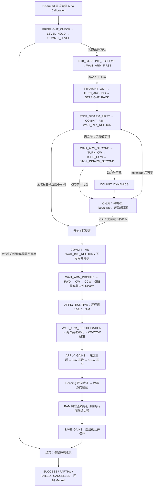
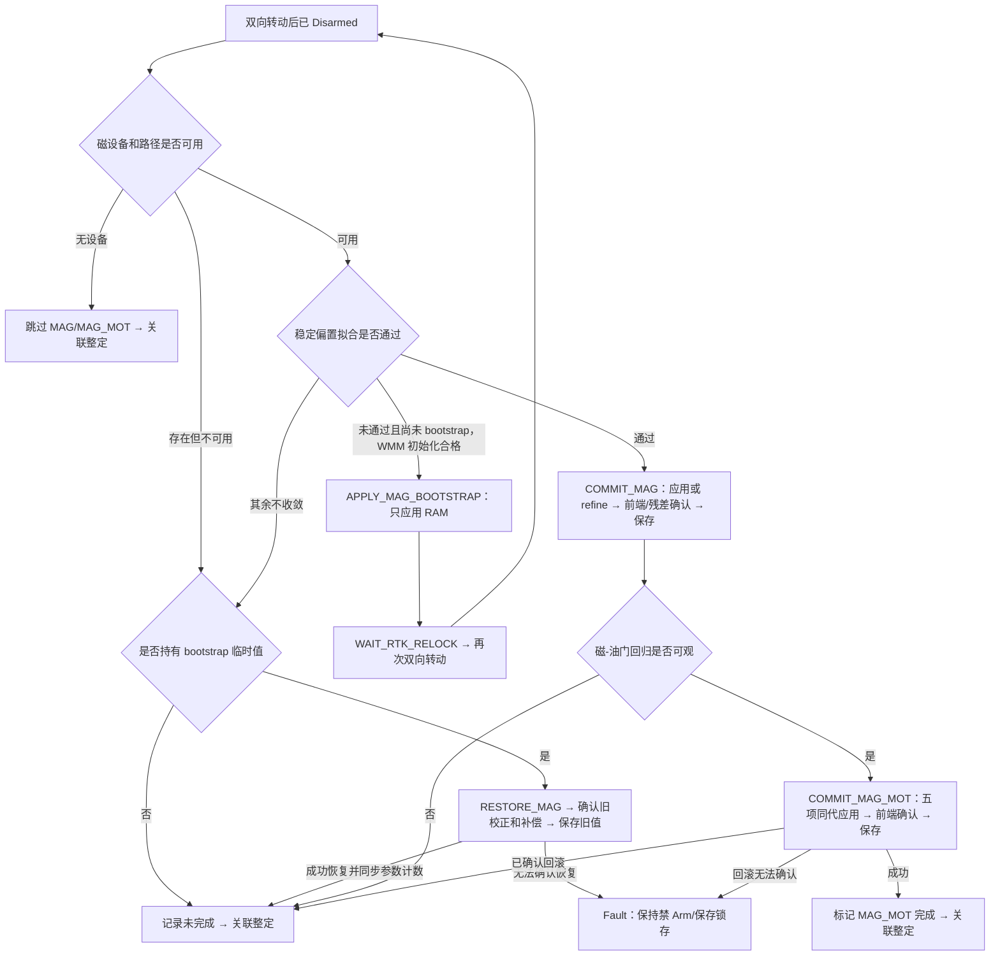
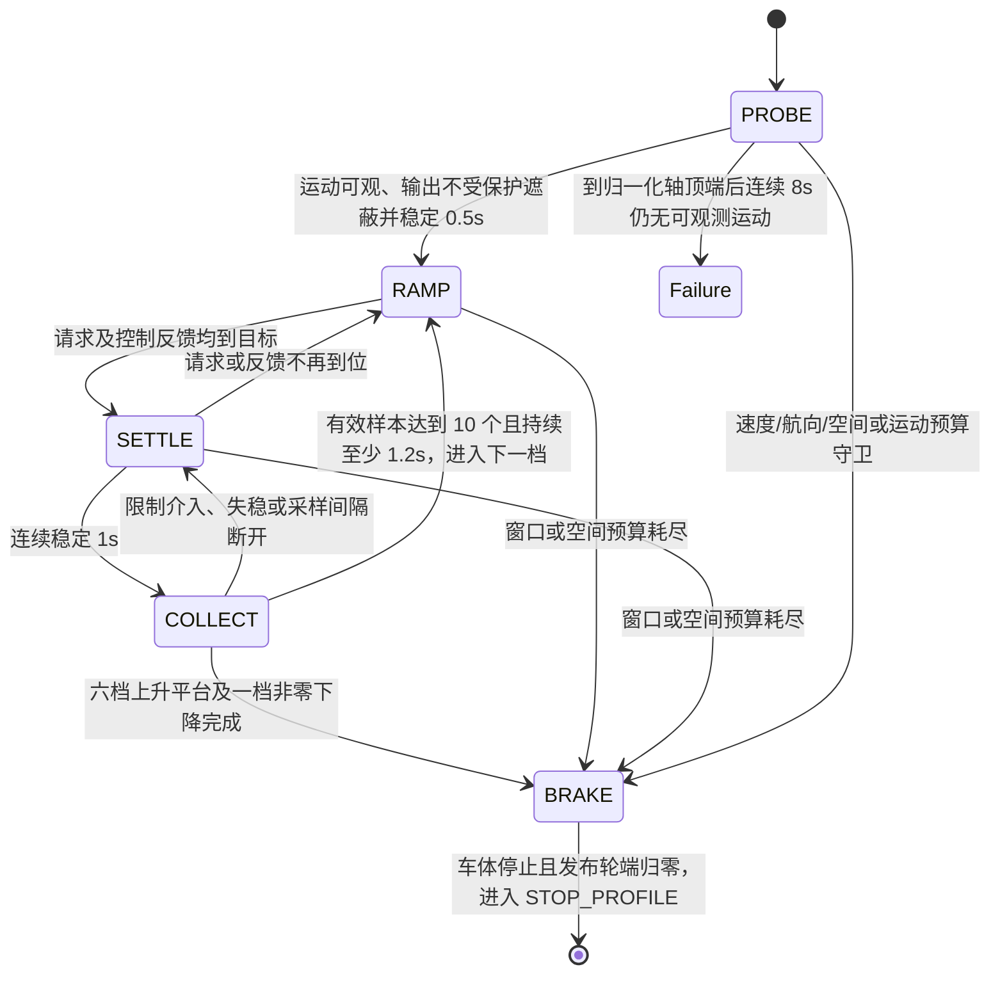
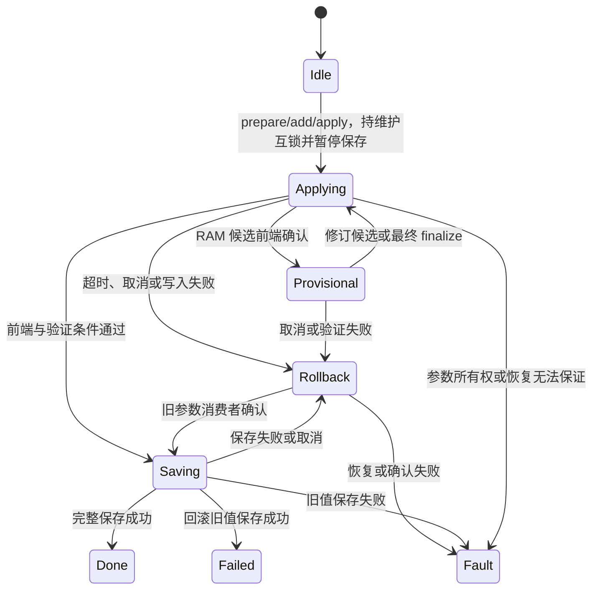

# 当前 Rover 自动校准详细状态机

更新：2026-09-14。本文描述当前源码中的行为与边界；枚举及消息布局的唯一权威源为 `Dima/messages/schemas/AutoCalibrationStatus.msg`，头文件、标签和日志契约由正式工具生成。

本模式使用三层状态：主流程 `state`、响应采集 `excitation_phase`、参数事务 `CalibrationParameters::Phase`；另有只属于 Commander 的会话运动授权。`result` 是结果，不是另一个可运动主状态。

## 1. 总体流程

图中的每次阶段续行均需 Commander 的原会话授权；后续自动 Arm 不意味着跳过 RC、Neutral、参数代次或正常 preflight。

## 2. 全程不变的安全边界

- 必须在 Disarmed 显式入场。入场冻结 `E=MOT_THR_MAX`、正 `V_session=RO_SPEED_LIM`、全球圆心、定位设备、半径及可信停车距离；不因阶段 Disarm、重融合或试用参数而移动圆心。
- 开环纵向请求 `[0,E]`；差速器入口除以 E 换成原有 `[0,1]` 整形坐标。闭环 PI 保持标准输入坐标，纵向输出受 `[0,E]` 限制；转向请求 `[-1,1]`，最终每轮 `[-E,E]`。
- 校准没有负纵向/负速度航段。CW/CCW 原地转向允许左右轮相反，并保留原有换向保护。
- 最终轮端变化率至多 0.15/s；校准命令超时至多 100 ms。实际速度不超过冻结上限，yaw-rate 不超过 0.6 rad/s，线/角加速度不超过原有 3 m/s²、3 rad/s² 门槛。
- 每个运动周期仍受 180 s 总守卫；整场包含等待、重融合、事务和保存，最长 600 s。阶段局部截止可更短，不能累加局部预算突破整场截止。
- 固定圆的 `R_work` 已扣除定位、延迟和停车余量。所有运行阶段逐周期检查原始 GNSS；额外的入场空间检查不代替实时守卫。
- RC loss、Kill、failsafe、估计器/设备/时间异常、围栏否定或外部改参撤销运动；安全消费者包括 Commander、RoverDifferential 与 MotorOutput，各自保留独立门禁。

## 3. 静态入场和 RTK 主状态

| 主状态 | 行为与正常出口 | 局部约束/失败出口 |
|---|---|---|
| `STATE_IDLE` | 模块启动后的空闲状态；显式入场建立新 session 后进入 PREFLIGHT_CHECK | 不创建运动授权 |
| `STATE_PREFLIGHT_CHECK` | 检查 Disarmed、新鲜 IMU/姿态和独立校准空闲；锁设备并请求 Level → LEVEL_HOLD | 30 s；已 Armed 或质量不满足则终止 |
| `STATE_LEVEL_HOLD` | 等待本次 Level 请求的正确终态；核对起始计数与自有写入增量 → COMMIT_LEVEL | 45 s；Level 失败/计数冲突终止 |
| `STATE_COMMIT_LEVEL` | 保存、重新读配置、标记水平成果；动态条件满足 → RTK_BASELINE_COLLECT | 保存 20 s；无入场定位或停车/动力配置无效时保留静态成果并结束 |
| `STATE_RTK_BASELINE_COLLECT` | 停稳下采集 100 个唯一 RTK 历元，拟合基线，检查直线空间 → WAIT_ARM_FIRST | 60 s；质量丢失重置累计，拟合不一致或空间不足退出 |
| `STATE_WAIT_ARM_FIRST` | 提示首次人工 Arm；质量/停止/空间及 Commander preflight 均通过 → STRAIGHT_OUT | 120 s；等待本身不放行动力 |
| `STATE_STRAIGHT_OUT` | 受速度守卫的前进、RTK 航向与基础速度采样；同时收集原始磁-输出数据 → TURN_AROUND | 本航段 90 s；请求到 0.995E 后连续 8 s 未达到运动判据 → DRIVE_ENVELOPE |
| `STATE_TURN_AROUND` | 停车后受控转向约 180°；近目标先制动、停稳后必要时再修正 → STRAIGHT_BACK | 60 s；不倒车，保留同一全球圆 |
| `STATE_STRAIGHT_BACK` | 朝返程方向前进，独立去重航向/速度证据；完成往返一致性检查 → STOP_DISARM_FIRST | 本航段 90 s；同样保留到顶 8 s 起步诊断 |
| `STATE_STOP_DISARM_FIRST` | 请求零输出，按地速/角速度确认停止，再由 Commander 内部 Disarm → COMMIT_RTK | 15 s；不会授予新 session |
| `STATE_COMMIT_RTK` | 原子提交 RTK 基线、航向偏置与 GNSS yaw 配置；消费者/融合稳定确认并保存 → WAIT_RTK_RELOCK | 应用/保存按事务截止；失败恢复当前组 |
| `STATE_WAIT_RTK_RELOCK` | GNSS yaw 连续融合超过 3 s；需动力学或磁学习 → WAIT_ARM_SECOND；无对应可做项目则进入关联整定 | 30 s；重融合失败终止 |
| `STATE_WAIT_ARM_SECOND` | 原 session 自动续行，仍检查停止、质量、磁路径或动力学需求 → TURN_CW | 120 s |
| `STATE_TURN_CW`、`STATE_TURN_CCW` | 基础动力学及磁学习的顺/逆旋转；每向至少覆盖一圈；CW → CCW → STOP_DISARM_SECOND | 每向 75 s；首圈后为磁样本最多再等 45 s，仍受 75 s 总截止 |
| `STATE_STOP_DISARM_SECOND` | 停止并内部 Disarm；动力学有证据 → COMMIT_DYNAMICS，否则进入磁分支 | 15 s；缺基础 FF 不伪造参数 |
| `STATE_COMMIT_DYNAMICS` | 最大油门速度与 yaw 修正同组提交/确认/保存 → 磁分支 | 失败只回滚该事务，不撤销已保存的 RTK |

RTK 航段的无运动升档按时间继续，不再需要先行驶出距离。停车判据为地速小于 0.08 m/s、yaw-rate 绝对值小于 0.05 rad/s；它描述可观测停止，不是编码器零转速证明。

## 4. 磁基础校准和磁-油门补偿

- `STATE_APPLY_MAG_BOOTSTRAP` 只做一次有界 WMM 初始化，事务进入 Provisional，保留最初旧值并暂停保存。
- `STATE_COMMIT_MAG` 在 bootstrap 已存在时使用同组 refine；基础校正确认与停车残差稳定通过后才保存并标记 MAG。
- `STATE_RESTORE_MAG` 的事务 `Failed` 表示候选已失败、旧值已恢复并保存。它与 `Done` 一样先同步 `expected_set_count_`，再继续整定，不误报外部改参。
- `STATE_COMMIT_MAG_MOT` 是独立五项只读观测参数事务。基础磁成功不代表该阶段成功；只有消费者确认和保存完成后才标记 MAG_MOT。
- 回归使用去程/返程各自截距、公共逐轴斜率；至少 100 个样本、每段至少 30 个，输出跨度与方差、0.08 G 残差门槛均保留。最后按 `K_body=R*S*K_sensor` 转换。
- 前端在原始磁场校正到机体系后、窗口累计之前应用 `B−K*u`；仅两轮均非负、设备和代次匹配、输出在磁样本之前 100 ms 内时使用。原地转向及倒退不套用直线模型。
- 磁校正/安装角改参在同一参数事务中失效补偿 ID；回滚最后恢复观测组。GEN 正常提交递增，溢出拒绝。干扰率未知为 -1，可超过 100%，大于 30% 给硬件整改提示。

## 5. IMU 与响应剖面主状态

| 主状态 | 正常行为与出口 | 约束 |
|---|---|---|
| `STATE_COMMIT_IMU` | 根据实际前端快照和 EKF 稳定偏置提交候选；初次确认 → WAIT_IMU_RELOCK；最终确认保存 → WAIT_ARM_PROFILE | 不改变 accel scale；不合格/关闭则记录未完成并继续 |
| `STATE_WAIT_IMU_RELOCK` | 在同一 RAM provisional 事务中等待前端/EKF 新代残差连续 3 s 合格 → COMMIT_IMU 最终保存 | 30 s；超时回滚，确认恢复后继续 Profile |
| `STATE_WAIT_ARM_PROFILE` | 首段先采至少 5 s、50 个未零区化噪声样本；FWD 检查直线空间，CW/CCW 检查转动空间；取得续行授权 → 对应 PROFILE 状态 | 每次等待 30 s；会话已超过 390 s 不启动该段；首次开始 Profile 不晚于会话 300 s |
| `STATE_PROFILE_FORWARD` | 前进响应：起步探测、六档平台和一档非零下降 → 停车 → STOP_PROFILE | 纵向非负；实际速度、航向、空间守卫优先 |
| `STATE_PROFILE_RATE_CW` | 正向角速度响应 → 停车 → STOP_PROFILE | 使用转向空间，不要求五米直线 |
| `STATE_PROFILE_RATE_CCW` | 反向角速度响应 → 停车 → STOP_PROFILE | 校准纵向仍为零 |
| `STATE_STOP_PROFILE` | 排空轮端后内部 Disarm；序号 0→1→2，FWD 后至少三个有效平台才能进入 CW；CCW 后计算运行候选 → APPLY_RUNTIME | 停车/Disarm 15 s；序号 3 为收尾，不是新的运动阶段 |
| `STATE_APPLY_RUNTIME` | 运行/FF 候选只应用到 RAM，前端同代确认 → WAIT_ARM_IDENTIFICATION | 同一 32 槽事务保留最初旧值；不包含全局电机整形/SLEW 参数 |

转动入场需满足 `R_work−d > 0.5+2*L`，`L` 为配置 GPS/IMU 三维杆臂长度之和；旋转对定位点的最坏位移按两倍杆臂保守估计。它不重置圆心，也不取消每周期围栏判断。

### 响应采集子状态

所有子状态均优先执行全局安全守卫；图中的局部超时并不保证其他条件不会更早结束运动。

| 子状态 | 详细行为 |
|---|---|
| `EXCITATION_NONE` | 不在响应运动中，或已结束；子状态目标/剩余时间为零 |
| `EXCITATION_PROBE` | 等待 Arm ramp 后从零缓慢提高请求。前进运动门槛为 `max(0.08m/s,5σ)`，转向为 `max(0.03rad/s,5σ)`；初见运动立即保持请求，连续稳定 0.5 s 后锁定下界。只有到顶仍无可观测运动才计 8 s |
| `EXCITATION_RAMP` | 六档目标等距分布在已证实能动的下界与允许上界之间；第七档回到区间中点，仍为非零输入。前进请求 slew 0.05/s、转向 0.04/s，按实际 dt 计算；轮端独立保留 0.15/s |
| `EXCITATION_SETTLE` | 请求及反馈到位误差至多 0.001 标准输入；保护未遮蔽、MOT slew 已结束、实际加速度足够小且响应超过噪声门槛，连续满足 1 s |
| `EXCITATION_COLLECT` | 前进按至少 100 ms、转向按至少 20 ms 取唯一反馈。至少 10 点且覆盖 1.2 s 才完成当前平台；间隔超过 150 ms/40 ms、限制或失稳清当前平台并重新稳定 |
| `EXCITATION_BRAKE` | 请求零输入，直到车体停止且 `applied_longitudinal/applied_steering` 均接近零；随后主状态 STOP_PROFILE 内部 Disarm |

每个响应运动最多 90 s，且不晚于会话 585 s 开始停车，为最终停止保留 15 s。单平台预算按请求 slew、电机 slew、末端 slew 中最慢者加 8 s 稳定/采样余量计算，再受运动硬截止约束；已到位后才开始稳态累计，不再固定四秒跳档。

前进顶档只有在 COLLECT 的有效样本中观测到后端实际输出达到 `0.995E` 才一次性报告端点。高档遇到速度/空间限制可以保留此前合格平台停车，随后是否继续由原有至少三档、噪声和拟合门槛决定。未取得足够输出跨度不伪造全域能力。

过渡历史固定 256 槽；容量满时原位二倍抽稀并保留真实时间戳，避免慢斜坡覆盖不全，同时不增加无界内存。

## 6. 辨识、验证与最终关联保存

| 主状态 | 行为/后继 |
|---|---|
| `STATE_WAIT_ARM_IDENTIFICATION` | 原 session 内部续行；前两次速度辨识启动前预留 200 s，其余辨识预留 110 s；等待最多 120 s |
| `STATE_IDENTIFY_SPEED` | exercise 0、1 均为前进的独立响应试验，每次激励约 16 s；两次结束后 → STOP_IDENTIFICATION。单次状态硬截止 90 s |
| `STATE_IDENTIFY_RATE` | exercise 2 为 CW、3 为 CCW，每次约 16 s；结束 → STOP_IDENTIFICATION。单向状态硬截止 75 s |
| `STATE_STOP_IDENTIFICATION` | 请求停止、内部 Disarm。exercise=2 → WAIT_ARM_IDENTIFICATION 转入角速度；exercise=4 → 计算公式 PI，合格后 APPLY_GAINS |
| `STATE_APPLY_GAINS` | 在同一 provisional 事务内修订当前增益组，消费者/可运行配置稳定确认约 1 s → WAIT_ARM_VALIDATION |
| `STATE_WAIT_ARM_VALIDATION` | 原 session 续行，参数代次与前端必须确认；等待最多 120 s，预留后续 110 s |
| `STATE_VALIDATE_SPEED` | exercise 0..2：半幅上升、全幅上升、非零半幅下降 → STOP_VALIDATION |
| `STATE_VALIDATE_RATE` | exercise 3..5：CW 三段；6..8：CCW 三段 → STOP_VALIDATION。计数到 9 表示两轴验证完成，不再返回角速度组 |
| `STATE_VALIDATE_HEADING` | 双方向 Heading 响应，验证误差、低角速和退出行为 → STOP_VALIDATION |
| `STATE_VALIDATE_DRIVING` | 双方向“前进→停车→转向→恢复前进”验证，核对转驱滞回与候选真实生效 → STOP_VALIDATION |
| `STATE_VALIDATE_PATH` | 在固定圆中跑闭合瘦三角 RAM 路径；同一入口、相同首边，记录误差、耗时、样本数和各字段生效证据 → STOP_VALIDATION |
| `STATE_STOP_VALIDATION` | 停止并内部 Disarm。内环 exercise=3 → 等待角速度验证；exercise=9 → Heading；Heading → 转驱；转驱 → 路径；路径 → 有限候选比较/最终选回确认 |
| `STATE_SAVE_GAINS` | 对最终选中、已经实跑验证的关联参数整体 finalize；前端再确认、保存成功后将 RAM 证据转为已保存成果，计算最终 result 并退出 |
| `STATE_RESTORE_GAINS` | 失败时撤销运动授权，恢复整组最初参数、确认旧前端并保存旧值；不能留下新 FF 与旧未验证 PI 的混合 |

内环运行时计数守卫拒绝速度组外的 0..2 和角速度组外的 3..8 请求。修复后的正常验证顺序明确为：`速度三段 → 停车/Disarm → CW 三段 → CCW 三段 → 停车/Disarm → Heading`。

PI 仅来自模型公式；速度/角速度 FF 必须分别小于 `min(0.35,E)`、`min(0.30,E)`，不可行就报告未完成，不生成替代来源的降级 PI。单次验证段按 ramp、模型时间常数和稳态时间计算，不能超过原有 15 s；速度/角速度主验证状态及路径各保留 75 s 硬截止，Heading 单方向保留 30 s 截止，转驱状态保留 60 s 截止。

路径至少跑基线；只有敏感且有预算的字段才比较 0.8/1.25 等有限候选。420 s 后不启动新比较候选，510 s 后不启动新的路径/选回确认。胜出须改善超过基线 10% 与测量噪声门槛；选回另一组参数时还要应用并重新实跑。相关字段缺少生效证据，保留原值或整组回滚。

## 7. 参数事务与异常出口

- `Provisional` 释放阶段运动所需的维护互锁，但仍暂停所有物理保存；候选仅在 RAM。
- `Applying` 和 `Rollback` 各使用 20 s 确认截止；`Saving` 使用 20 s 保存截止，存储忙按现有异步接口推进。
- `Done` 是新值保存成功；`Failed` 是候选失败但旧值已恢复并保存。两者结束当前事务代次，继续下一阶段前同步计数。`Fault` 是不能证明回滚完成，不能当作可继续的普通失败。
- 外部 Disarm、切 Manual、Kill/故障和全局守卫先撤销运动并请求退出，Commander 清授权、Disarm 并切 Manual；协调器随后完成仍在进行的参数回滚。
- 运动中失败可能保留原主状态，由 pending_termination_ 驱动同一回滚；RESTORE_GAINS 是已 Disarmed 时的显式恢复状态，并非唯一回滚入口。
- 回滚无法确认时保持 `FAILED`、active/维护锁存及明确报错，禁止重新 Arm/开始新会话；不会静默放弃事务。

## 8. 完成、跳过与最终结果

| 字段/结果 | 当前含义 |
|---|---|
| `completed_stages` | 已确认并保存的完整阶段；RAM 验证不能直接进入此集合 |
| `provisional_validated_stages` | 本次候选已实跑验证但整组尚未保存的证据，失败/退出后清除 |
| `unavailable_stages` | 本模式支持但证据、条件或验证不足的项目，影响最终完整性 |
| `skipped_stages` | 能力范围外或无设备，不尝试、不声称完成。当前全局电机整形/SLEW 为 MOTOR_PROFILE 跳过；无磁时跳过 MAG/MAG_MOT |
| `SUCCESS` | 必需阶段已完成，无 unavailable、无失败原因、非用户取消；存在磁设备时还必须完成 MAG 与 MAG_MOT。只代表当前模式适用范围成功 |
| `PARTIAL` | 已有保存成果，但某个支持项目未完成或存在失败原因；例如磁偏置成功而补偿未学成 |
| `FAILED` | 没有成功成果的失败，或无法确认回滚导致的故障锁存 |
| `CANCELLED` | 用户取消，正常停止及回滚后结束；若回滚发生 Fault，则故障优先 |

结果没有专门的成功/失败主状态。正常结束保留最后主状态用于诊断，`active=false`、`result` 给出结果；返回 Manual。新会话由新的显式模式动作建立并从 PREFLIGHT_CHECK 开始，旧授权不恢复。

全局电机整形/SLEW 的跳过不会让 SUCCESS 永远不可达，也不会让这些项目伪装为已校准；对应参数未纳入本模式写入事务。IMU、运行/导航等支持项目仍按各自观测/配置门槛报告完成或未完成。

## 9. 日志、离线建议与验收范围

- 入场产生 `session=<id> begin`，周期状态及终态携带会话号；`skipped` 与 `unavailable` 分别报告。
- 每五秒报告主状态、激励子状态/档位/目标/有效样本数/运动剩余预算，以及端点、磁干扰率、补偿完成和磁设备存在的证据快照。
- 同一会话的周期输出、重复终态不清空离线证据。新会话号/明确 begin 才隔离上下文；无起始事件的重连导出可从周期证据恢复结果。旧版明确入场行仍可解析。
- 本轮使用 Linux 原生正常构建和工具内存/临时输入冒烟，不新增测试文件/框架或测试基础设施。没有执行烧录、串口或车辆动作。
- 源码、生成、编译和工具检查不能证明真实车辆已完成校准。起步阈值、真实停止距离、磁补偿效果、掉电恢复、QGC 显示以及控制器性能仍属于板端验收。

## 10. 本轮验收记录

2026-09-14 最终执行 `make PYTHON=python3 BUILD_DIR=build-linux dima_rover`，exit 0，耗时 103.52 s。正式生成链更新消息、标签与日志合同。36 项生产解析器/CLI 内存及临时输入冒烟通过，包含周期终态重复、会话切换、重连证据、QGC 两列/五列参数及错误输入；输入文件哈希保持不变。源码空白检查通过。

文档覆盖核对：43 个主状态及 6 个激励子状态全部对应权威 schema，无遗漏或不存在的状态名。应用 Flash 601460/782336 B（76.9%），DTCM 静态 60896 B，D2 数据 200416 B。

| 制品 | 字节数 | SHA-256 |
|---|---:|---|
| `build-linux/H743_FreeRTOS.elf` | 11078512 | `d5314b59ee1463f1200e3e17afc3ebeb74471c52f91eb328971715b3972367f2` |
| `build-linux/H743_FreeRTOS.bin` | 601460 | `173c4974fe67fbbe0e04e9b4e97cd0ab1b82c66f791bd2260f1cee23a7c9053e` |
| `build-linux/H743_FreeRTOS_signed.bin` | 602636 | `cf110c27bdb76ecd73533111795be250c7125417ef530a5b276e3e8b09bbf5bf` |
| `build-linux/H743_FreeRTOS_factory.hex` | 1547664 | `c1b77f890e8ace18ca76b898dac003728ea880403ab4a2d24441a44111152468` |

以上为本机源码/生成/构建和离线工具证据；没有新增测试文件/框架，没有执行独立 verify、刷机、串口或车辆测试。完整动态流程、QGC 显示、断电恢复和真实控制性能仍需板端验收。

### Manual 维护互锁与校准续行修复（2026-09-14）

- 普通启动/改参的参数保存、SD 镜像或驱动配置持有 Runtime maintenance，期间禁止 Arm 属于正常保护。拒绝日志现报告占用方、等待阶段、年龄及撤销原因；维护结束后就绪投影自动恢复，Manual 必须重新发出 Arm。
- BootHealth 已修正复制前取时造成的“未来帧”误判，并允许新鲜、无故障 Disarmed 三 Topic 在短暂让出调度后收齐；等待期间不签发健康代次，不扩大原有看门狗、输出或维护超时边界。
- 校准保存使用 External1 的健康 Disarmed 维护许可，不再被仅适用于 MCUboot 镜像确认的 Manual 条件阻塞。授权续行在维护结束后仍要求下一条新鲜请求，并复验会话、参数代次、预检及原子 Arm 门。
- 启动新增 `Boot reset` 记录，保留 Board 捕获的原始复位标志及上次 fault/PC。源码实现不等于已复现用户设备上的重启原因；须用更新后的板端日志确认。
- 本轮 `make PYTHON=python3 BUILD_DIR=build-linux dima_rover` 通过（exit=0，140.82 s）；应用 BIN 602548 B，签名镜像 603724 B，DTCM 静态 60896 B。未新增测试基础设施，未执行独立 verify 或设备操作。启动/改参后 Manual 恢复解锁、校准保存后续行、实际 IWDG/异常复位原因显示仍为板端待验收。
